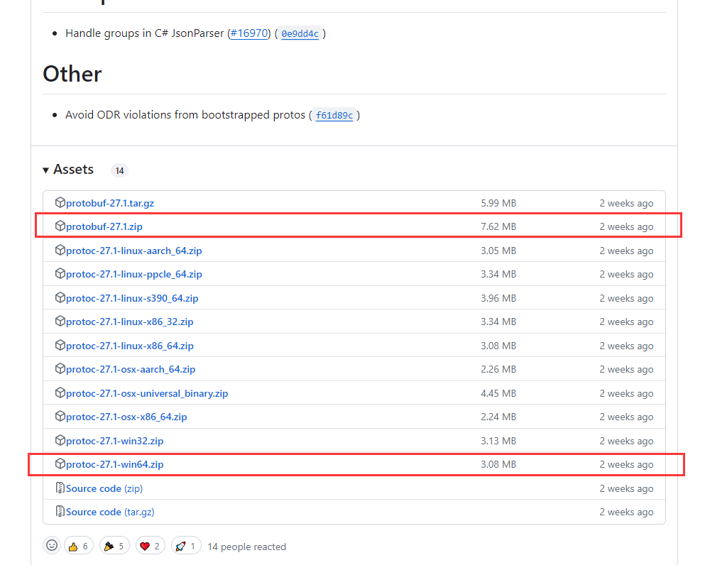
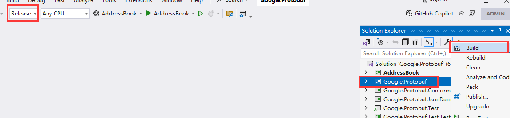
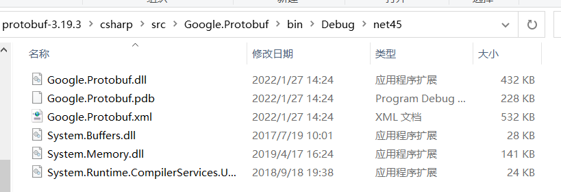

# ServerTest
C++ Server, Unity Client

## Unity Protobuf Install
* download zip followed  
  
* use vs open `protobuf-27.1/csharp/src/Google.Protobuf.sln`
* if have error, use cmd get dotnet version `dotnet --version`, replace dotnet version in `global.json` in root folder
* build `Google.Protobuf`  
  
* copy files from output to unity  
  

# Reference Links
* [Protobuf 在Unity中的使用](https://blog.csdn.net/weixin_42498461/article/details/122719169)

