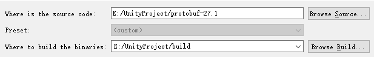
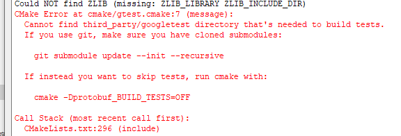
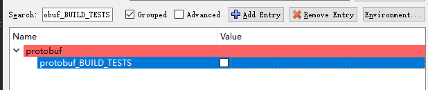
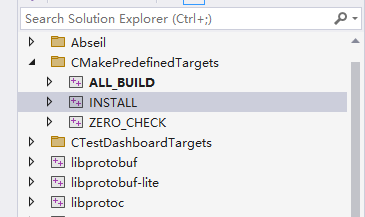
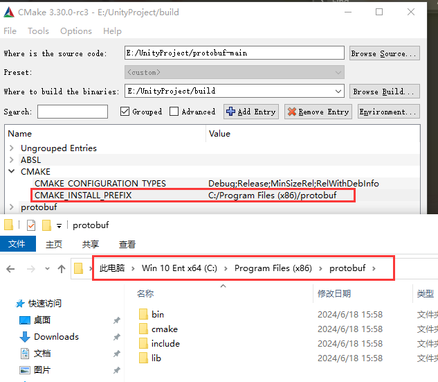
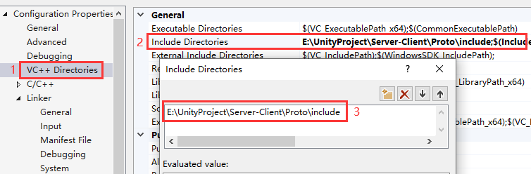
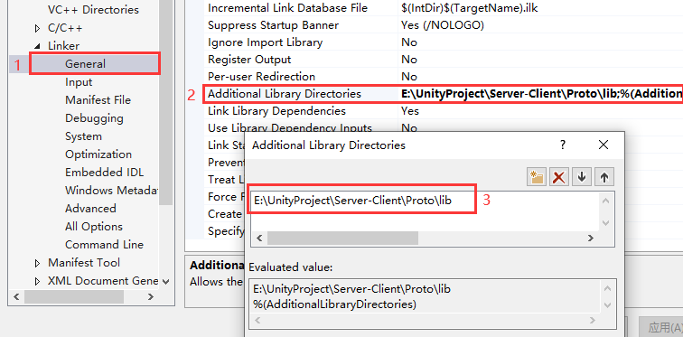
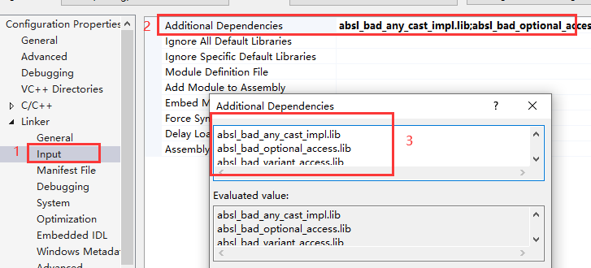
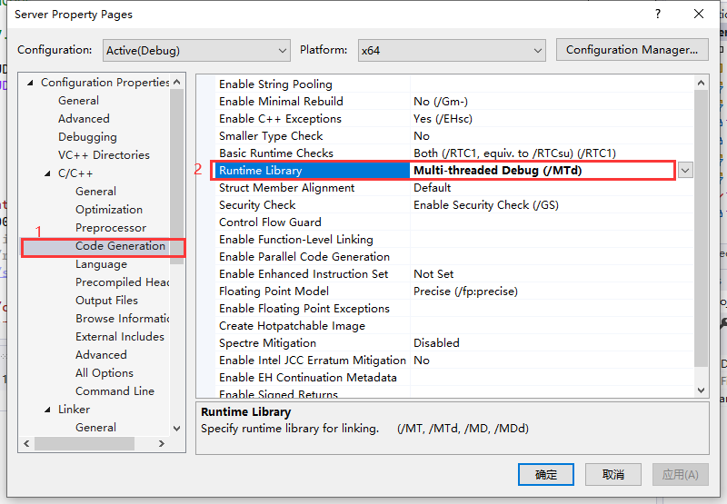

# ServerTest
C++ Server, Unity Client

# Environment
* Unity version 2022.3.17f1
* Protoc version 27.1
* vs version 2022, console app (c++)

# Protobuf Install
## Unity Protobuf Install
* download zip followed  
  
* use vs open `protobuf-27.1/csharp/src/Google.Protobuf.sln`
* if have error, use cmd get dotnet version `dotnet --version`, replace dotnet version in `global.json` in root folder
* build `Google.Protobuf`  
  
* copy files from output to unity  
  

## C++ Protobuf Install
* clone protobuf, clone abseil at `protobuf-27.1\third_party\abseil-cpp`
* use cmake, confirm protobuf root folder and build folder,configure and generate project  
  
  * caused error  
    
  * find `protobuf_BUILD_TESTS` and uncheck  
    
* open `protobuf.sln`, build `INSTALL` solution  
  
* get build folder at `CMAKE_INSTALL_PREFIX`, copy them to self solution folder  
  
* add include  
  
* add lib  
    
  libs split by `;`
    
  here is the sample input for lib names generated by csharp...  
  ```
  absl_bad_any_cast_impl.lib;absl_bad_optional_access.lib;absl_bad_variant_access.lib;absl_base.lib;absl_city.lib;absl_civil_time.lib;absl_cord.lib;absl_cordz_functions.lib;absl_cordz_handle.lib;absl_cordz_info.lib;absl_cordz_sample_token.lib;absl_cord_internal.lib;absl_crc32c.lib;absl_crc_cord_state.lib;absl_crc_cpu_detect.lib;absl_crc_internal.lib;absl_debugging_internal.lib;absl_demangle_internal.lib;absl_die_if_null.lib;absl_examine_stack.lib;absl_exponential_biased.lib;absl_failure_signal_handler.lib;absl_flags_commandlineflag.lib;absl_flags_commandlineflag_internal.lib;absl_flags_config.lib;absl_flags_internal.lib;absl_flags_marshalling.lib;absl_flags_parse.lib;absl_flags_private_handle_accessor.lib;absl_flags_program_name.lib;absl_flags_reflection.lib;absl_flags_usage.lib;absl_flags_usage_internal.lib;absl_graphcycles_internal.lib;absl_hash.lib;absl_hashtablez_sampler.lib;absl_int128.lib;absl_kernel_timeout_internal.lib;absl_leak_check.lib;absl_log_entry.lib;absl_log_flags.lib;absl_log_globals.lib;absl_log_initialize.lib;absl_log_internal_check_op.lib;absl_log_internal_conditions.lib;absl_log_internal_fnmatch.lib;absl_log_internal_format.lib;absl_log_internal_globals.lib;absl_log_internal_log_sink_set.lib;absl_log_internal_message.lib;absl_log_internal_nullguard.lib;absl_log_internal_proto.lib;absl_log_severity.lib;absl_log_sink.lib;absl_low_level_hash.lib;absl_malloc_internal.lib;absl_periodic_sampler.lib;absl_random_distributions.lib;absl_random_internal_distribution_test_util.lib;absl_random_internal_platform.lib;absl_random_internal_pool_urbg.lib;absl_random_internal_randen.lib;absl_random_internal_randen_hwaes.lib;absl_random_internal_randen_hwaes_impl.lib;absl_random_internal_randen_slow.lib;absl_random_internal_seed_material.lib;absl_random_seed_gen_exception.lib;absl_random_seed_sequences.lib;absl_raw_hash_set.lib;absl_raw_logging_internal.lib;absl_scoped_set_env.lib;absl_spinlock_wait.lib;absl_stacktrace.lib;absl_status.lib;absl_statusor.lib;absl_strerror.lib;absl_strings.lib;absl_strings_internal.lib;absl_string_view.lib;absl_str_format_internal.lib;absl_symbolize.lib;absl_synchronization.lib;absl_throw_delegate.lib;absl_time.lib;absl_time_zone.lib;absl_vlog_config_internal.lib;libprotobuf-lited.lib;libprotobufd.lib;libprotocd.lib;libupbd.lib;utf8_range.lib;utf8_validity.lib;
  ```
* change runtime-library to MTD  
  
* run and test

# Reference Links
* [Protobuf 在Unity中的使用](https://blog.csdn.net/weixin_42498461/article/details/122719169)

